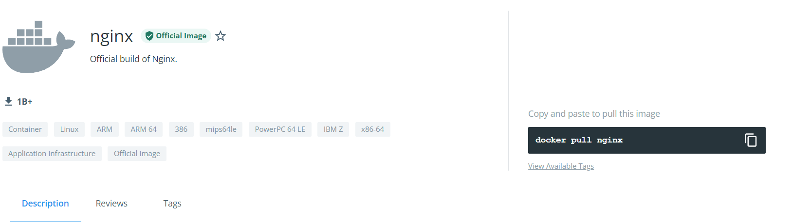
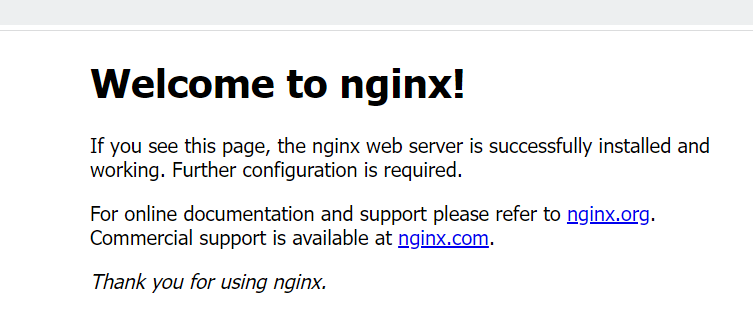
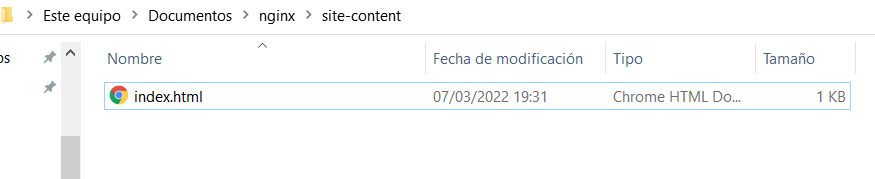
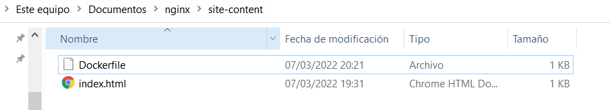
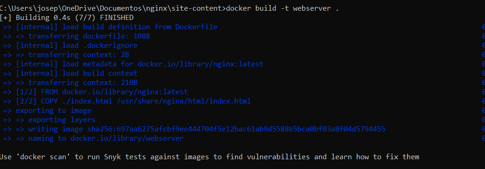

# Nginx-docker

# Primero de todo nos instalamos el docker de nginx de dockerhub



## Arrancamos el contenedor 

``` 
docker run --rm -d -p 8080:80 --name web nginx 
```



# Agregar HTML personalizado

Creamos un repositorio donde se encontrará nuestro html que utilizará nuestra web.



En index.html metemos:

```
<!doctype html>
<html lang="en">
<head>
  <meta charset="utf-8">
  <title>Docker Nginx</title>
</head>
<body>
  <h2>Hello desde Cibeseguridad</h2>
</body>
</html>
```

Y ejecutamos el siguiente comando que montara nuestro directorio local en el contenedor en ejecucuión en **/usr/share/nginx/html**
```
docker run --rm -d -p 8080:80 --name web -v ~/Documentos/nginx/site-content:/usr/share/nginx/html nginx
```

# Crear una imagen personalizada 

Generamos un Dockerfile en el mismo repositorio y metemos el siguiente código:



```
FROM nginx:latest

COPY ./index.html /usr/share/nginx/html/index.html
```

Construimos nuestra imagen:



Ejecutamos nuestra imagen:


Demostración:

